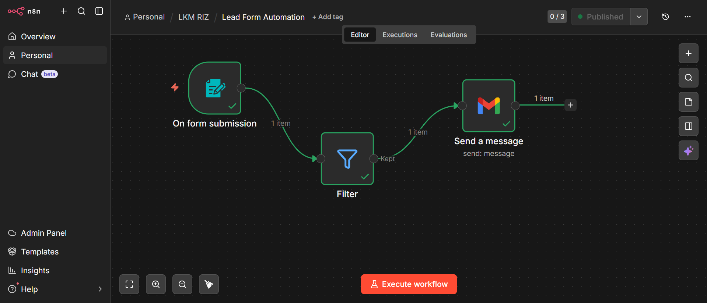

# Lead-Form-Automation
Below is the assignment of the workflow. 
1. Create a new workflow.
2. Add a trigger to capture form submission 
3. Use the filter node to only allow budgets above 100,000.
4. Send a gmail notification with the captured lead details.
5. Test the workflow with the high and low budget.
 

⚡ The lead form Workflow

This workflow is a selective alert pipeline. It doesn’t just react; it decides what deserves attention.

It starts with “On form submission,” where each new entry triggers the workflow automatically.

Instead of processing every submission blindly, I introduced a Filter node to enforce logic. Only qualified data is allowed to move forward.

Once the data passes the filter, a Gmail alert is triggered.

### Purpose of workflow 
1. Send real-time alerts for important submissions
2. Eliminate noise from irrelevant data
3. Enable faster and more focused decision-making
